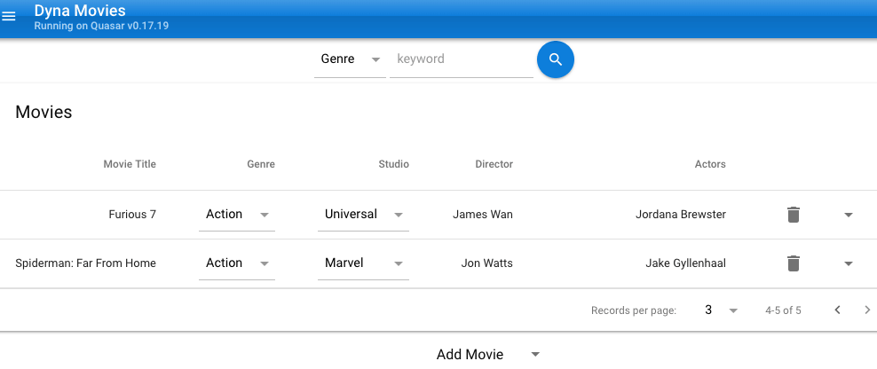

# Dynamovie
Single Page Web App to manage a movie database using Amazon's DynamoDB

## Install
### Requirements
* node v11.6.0
* python 3.7.2
* quasar 0.17.19
* vue 3.2.3

Npm's `dynalite` package claims to easily run local DynamoDB, but is not
available for the current Node version.

### Linux
Untested! (send feedback)

#### Ubuntu, Debian, Mint
* sudo apt-get install python3 awscli openjdk

#### RedHat, Centos, Fedora
* sudo rpm i python3 awscli openjdk

#### All Linux
* https://docs.aws.amazon.com/amazondynamodb/latest/developerguide/DynamoDBLocal.html
* pip3 install pyenv-virtualenv pyenv-virtualenvwrapper

### Mac OSX
* Install [Homebrew](https://brew.sh/)
* `brew install python3 --with-brewed-openssl`
* `brew install awscli cask node pyenv-virtualenv pyenv-virtualenvwrapper`
* `brew cask install dynamodb-local`
Dynamovie: A responsive, single page progressive movie database using Amazon's DynamoDB.
It is possible to adapt this with your legacy web application.
Uses Quasar Vue.js framework, and Python Django ReST framework.

### MS Windows
Todo (send feedback)
* Consider Cygwin or Windows 10 Bash shell

### All
Linux may require `sudo` for the following
* `npm i -g eslint-plugin-vue quasar-cli vue-cli @vue/cli-init`
* `git clone git@github.com:bingalls/dynamovie.git`
* `cd dynamovie`

### DynyamoDB Local Setup
* `cd api/scripts`
* `bash createMoviesTable.sh`
* `bash seedMovie.sh` # optional

### Python Setup
* `cd api`
* `python3 -m virtualenv venv`
* `pip3 check`
* `pip3 install -r requirements.txt`
* `ln -s venv ..` # for your IDE

Mac & Linux users may clean up newlines for git:
* `find venv -name RECORD|xargs dos2unix -`

## Run
* `./start.sh`
* Should automatically open browser with http://localhost:8080/
* You can debug ReST API in http://127.0.0.1:8000/movies/
* Call `./stop.sh` before closing terminal, to clean up background services
* Edit api/dynamovie/settings.py before running in production! Settings are *not secure*

## Testing
This has only been tested on a desktop, with DynamoDB running on localhost.
Robust static analysis has been applied, including
* eslint
* stylelint
* flake8
* pydocstyle
* pylama

However, this code needs unit and integration testing

## Road Map & Known Bugs
This code is not fully polished for production. 
With community support, the following will be improved:

* Quasar is still a beta release
* Fewest Quasar files were changed, to ease upgrades. For example, side menu is unchanged.
* No TLS, nor authentication. Updates & deletes should be restricted for a production release.
* API's host url setting in Index.vue should be moved to a file similar to quasar.conf.js
* API can be richer: versioning, schema, graphql, etc
* Pagination is currently client side, only. Server pagination is commented, untested.
* Studios & Genres come from a limited static list
* Move to TypeScript, just like the next version of Vue & Quasar
* The table is too wide for mobile. Open to suggestions.
* Sanitization disallows '&' in movie titles, for example
* Deleting a row reloads page. Perhaps too heavy, and untested on native mobile
